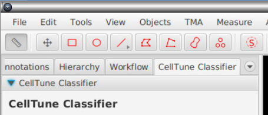
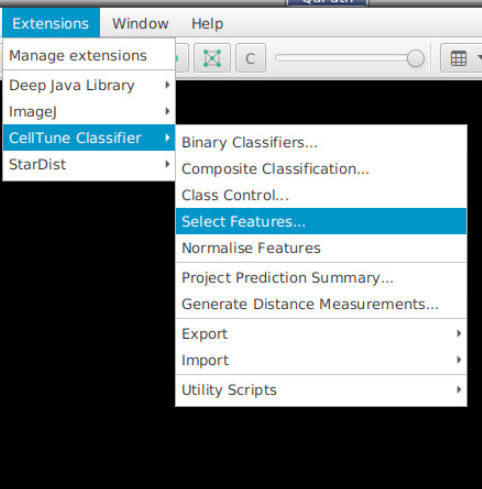

# Install & launch

1. **Download** `qupath-extension-sp-classify-0.3.1-all.jar` from the [Releases page](https://github.com/mikemcka/qupath-extension-sp-classify/releases), or build it from source — see [CLAUDE.md](https://github.com/mikemcka/qupath-extension-sp-classify/blob/main/CLAUDE.md).
2. Drop the JAR into QuPath's `extensions/` folder, or drag-and-drop it onto the running QuPath window.
3. Restart QuPath. The **SP Classify** panel docks into the analysis tab pane on the right, you can mouse over the area and scroll the mouse wheel to uncover it.
4. Some commands also live under the **Extensions → SP Classify** menu.

Disable the extension at any time from **Edit → Preferences → SP Classify → Enable**.

---
