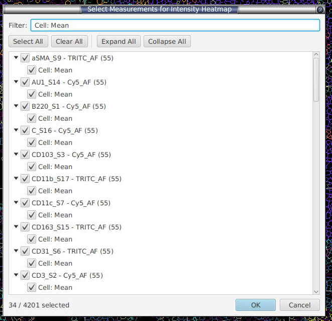
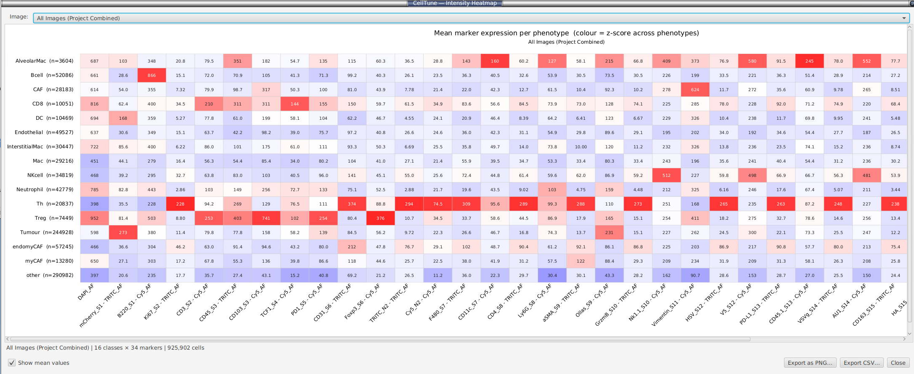

# Intensity heatmaps

**Menu:** *Extensions → SP Classify → Intensity Heatmaps...*

A phenotype × marker heatmap of **mean whole-cell intensity per predicted cell class** — the standard "mean marker expression per phenotype" view used to sanity-check that each class actually expresses the markers it should (e.g. CD8⁺ T-cells are high for CD8, Tregs high for FOXP3).

Rows are cell classes (the `PathClass` assigned to each detection), columns are markers (every `"<marker>: Cell: Mean"` whole-cell measurement), and each cell is the mean intensity of that marker across all cells of that class.

When you open the heatmap you first pick which whole-cell mean measurements to include:

**Colour = z-score across phenotypes.** Each marker column is standardised across the class rows, so the colour highlights *which phenotype is relatively high (red) or low (blue)* for that marker, independent of the marker's absolute brightness. A diverging blue↔white↔red scale is used with a colorbar legend; grey means "no cells of that class had a valid value for that marker". The numeric mean can be overlaid in each cell via **Show mean values**.

**Image selector** (top of the window):
- **The current image** (selected by default).
- **Any other project image** — loads that image's saved data in the background and computes its heatmap on demand (results are cached after the first load).
- **All Images (Project Combined)** — a project-wide heatmap computed from **true pooled means** (every cell across every image contributes equally), not an average of per-image averages.

**Buttons:**
- **Export PNG** — saves the heatmap exactly as drawn (white background).
- **Export CSV** — a `Class, CellCount, <marker>…` table of the underlying mean intensities (`NA` where a class had no valid value).

> The heatmap needs whole-cell mean intensity measurements (`"<marker>: Cell: Mean"`). If your detections don't have them, run QuPath cell detection / intensity measurement first. Classes come straight from the predictions in the viewer, so run a classifier (or apply gating) before opening the heatmap.

---
