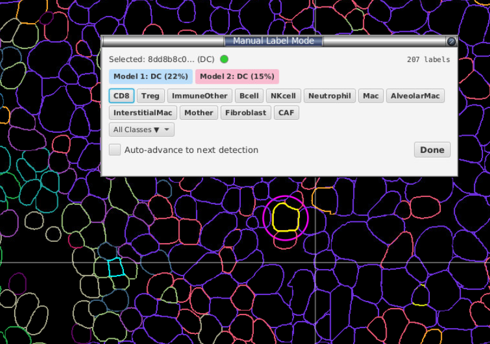
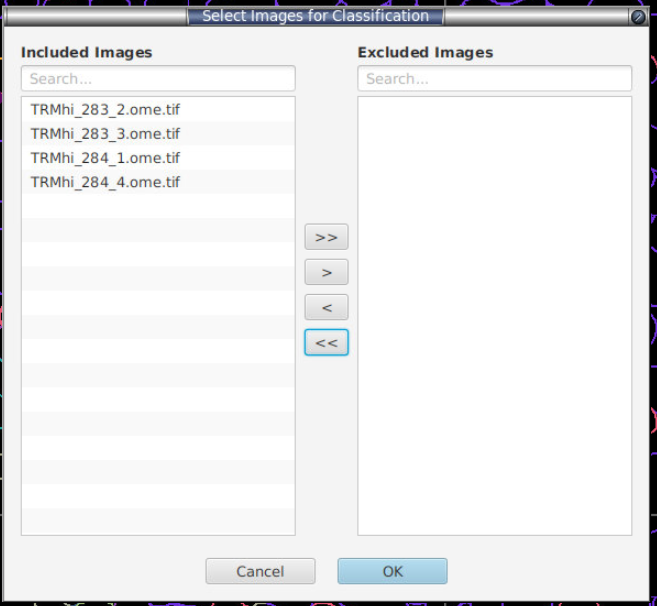
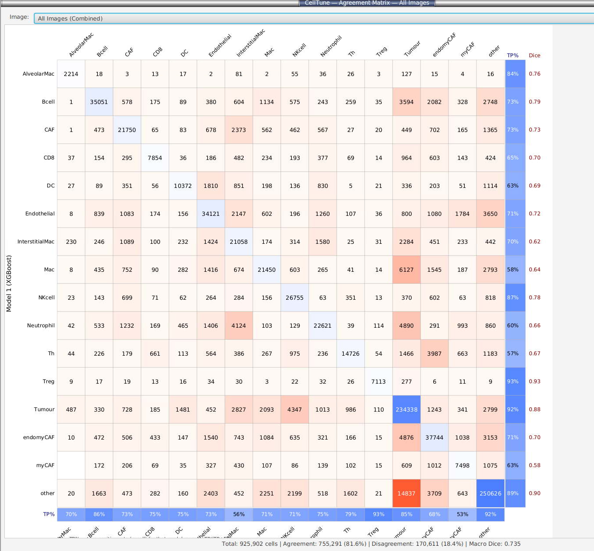
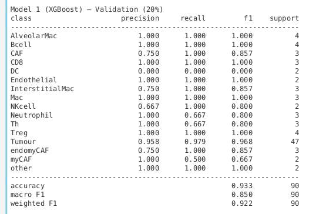
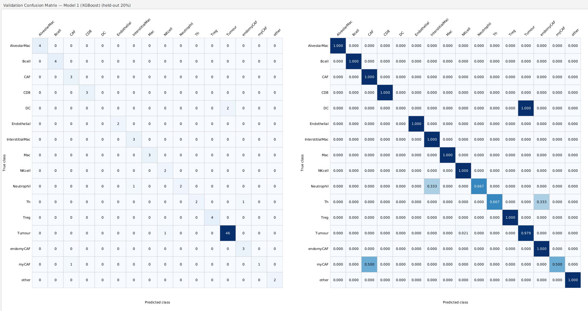
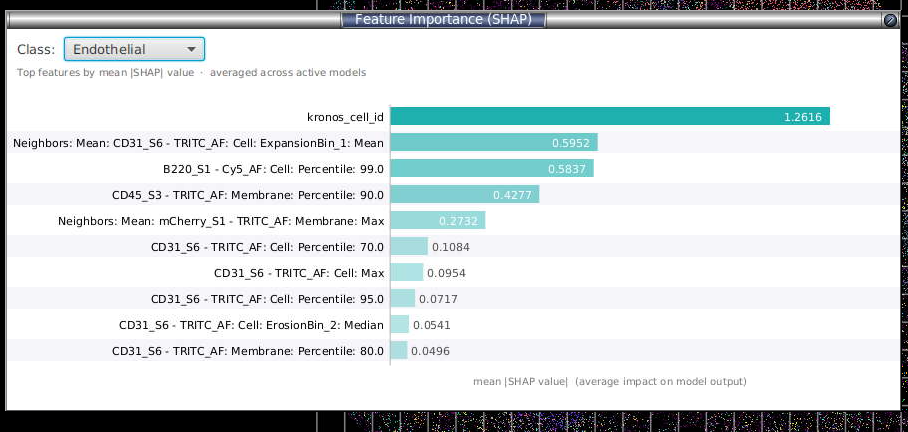
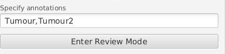

# Multi-class workflow in detail

### 5.1 Initial manual labelling

Click **Manual Label Mode** in the sidebar. A floating toolbar appears:



- Click a cell in the QuPath viewer → its ID and current class show at the top, the status dot turns lime if labelled, white if not.
- A **magenta ring** marks the selected cell (a lightweight overlay — won't slow down 50k+ cell images).
- Up to 12 quick-access class buttons appear inline; the rest live under **All Classes ▼**.
- **Auto-advance to next detection** — when ticked, assigning a label automatically jumps to the next cell.

**How many to label?** Aim for **at least 20–30 cells per class** before your first training run. The extension will refuse to train with fewer than 10 labelled cells total. You can — and should — add more after each review cycle.

> The **Model 1** / **Model 2** buttons only appear once you've trained at least once. They let you accept a prediction with one click. Background colour: blue = M1, pink = M2.

### 5.2 Choose images to apply the classifier to

Click **Apply to which images... (N)** above the train button.



- Dual-list selector. Left = images the classifier will predict on, right = excluded.
- Per-list search and Move-all/Move-selected arrows.
- The **currently open image is always included** and can't be moved out.
- Click **OK**; the button label now shows the count, e.g. `Apply to which images... (12)`.

This is a quick way to reduce prediction times but only focusing on one or a few images.

### 5.3 CPU threads and Images at once


Two speed controls. They do different jobs, so they are separate numbers. (Labels get cut off in a narrow panel — widen it, or hover for the full text.)

**CPU threads — makes training faster.**
Leave at **0**, which means "use all CPU resources. Lower it only if you want to keep working in QuPath while a long training run happens in the background, or if you're sharing a compute node with someone. Your choice is remembered next time.

> One thing to know: changing this number can nudge the results very slightly. Neither setting is more correct. If you're comparing two training runs, just use the same number for both.

**Images at once — makes *applying* the classifier to other images faster.**
This only matters after training, when the classifier is being applied to the other images you picked. Each image being processed has to be fully loaded, so this uses memory rather than processor. **1** on a 16 GB machine, **2–3** on 32 GB. Maximum 8. If you set it too high, QuPath may run out of memory.

### 5.4 Pick the right settings

The defaults are tuned for typical multiplex panels. Adjust as follows:

| Setting | Default | Turn ON when… | Turn OFF when… |
|---|---|---|---|
| **Pool labels from all images** | ✅ | (always; auto-on in binary mode) | training a per-image model intentionally |
| **Enable data balancing** + `SMOTE + Tomek` | ✅ | one class << others (typical multiplex) | classes are already balanced or you want raw counts |
| **Auto-tune hyperparameters** | ❌ | first/last build of a new panel, and you can leave it overnight | iterating fast; defaults known to work |
| **Early stopping** | ✅ | (always — no downside) | reproducing a paper with a fixed round count |
| **Train/val metrics** | ✅ | you want the Training Metrics report | iterating fast — it costs about ⅓ of training time |
| **Show top 10 feature importance** | ✅ | (always — cheap) | reducing UI clutter |
| **Auto-prune features** | ✅ | (always — non-destructive, faster training) | running a reproducible benchmark |
| **Restrict to features shared with imported data** | ❌ | merging labels imported from a different panel | training on this project only |
| **Sample current image only** | ❌ | drilling into one tricky FOV | (default — covers whole project) |

**Resampling strategies** (visible when Enable data balancing is on):

**Leave as default if you don't understand this** This is complicated and involves generating synthetic data or removing datapoints from a feature set which will vary as your training dataset changes over time.

| Strategy | Effect |
|---|---|
| `NONE` | No resampling |
| `SMOTE` | Synthetic minority oversampling (k=5 nearest same-class neighbours) |
| `ADASYN` | Like SMOTE but concentrates synthetics on hard-to-classify minorities |
| `TOMEK` | Removes majority-class members of mutual nearest-neighbour pairs (cleans boundary) |
| `SMOTE + Tomek` (default) | SMOTE, then Tomek cleanup |
| `ADASYN + Tomek` | ADASYN, then Tomek cleanup |

Defaults work for ~90% of cases. Switch to `SMOTE` alone if Tomek is removing too much real signal; switch to `ADASYN` if a minority class lives in a hard region of feature space.

**Train/val metrics.** On by default. This is what fills in the **Training Metrics** report (per-class scores). Producing it means training each model a second time on part of your data, which costs roughly a third of the total training time. Untick it while you're still adding labels and re-tick it for the run you want to keep — your classifier is identical either way, you just don't get the report.

**Auto-tune is slow.** It trains 200 models to search for better settings. On a big panel that's hours, not minutes — plan for overnight. The training log tells you how many it's about to do.

**Models 1 & 2.** Default pair is **XGBoost + LightGBM**. Random Forest is also available. Keep the two model types **different** — that's the whole point of dual-model disagreement. Auto-tune runs independently per model.

**Training uses the CPU.** This is a CPU-only build; there is no benefit at this scale anyway — a graphics card only starts to pay off with far more labelled cells than a typical panel has.

**Rounds / Max depth.** Default 500 rounds, depth 6.

**Rounds is a limit, not a target** — as long as **Early stopping** is on (it is by default). Each model keeps adding rounds until it stops getting better, then stops on its own. So a model that only needs 130 rounds uses 130 and the setting costs you nothing; a model that would still be improving at 200 is no longer cut off. That's why the default is generous.

> ⚠️ **If you untick Early stopping, this becomes a literal count** and every round is trained. 500 rounds will then take much longer than 200. Lower it if you turn early stopping off.

The training log tells you what each model actually used: `best round 127/500` means it converged comfortably, while a number close to your limit means it was still improving and you could raise it further.

### 5.5 Train

Click **Train**. A progress dialog shows the current step (feature extraction, balancing, fold training, etc.). Before training starts, a timestamped backup of the label store is written to `<project>/celltune/labels_backup_*.json`.

**Before it starts**, SP Classify checks whether you have enough memory. If it looks tight, you get a warning with a Proceed/Cancel choice — cancelling now is cheaper than running out of memory twenty minutes in. It's a rough check, so it catches obvious problems rather than guaranteeing success.

Status bar after success: `Training complete — 523 cells classified, 47 disagreements.`

#### The training log file

Every run saves a copy of its log to `<project>/celltune/logs/`. The on-screen log disappears when you close the progress window; this one doesn't, and it survives a crash. The 20 most recent are kept. (Without a project there's nowhere to save it, so training just runs without one.)

The log starts with everything about the run — cell and label counts, every setting you used, your memory — so you can send it to someone without having to explain the setup.

It ends with where the time went, slowest first:

```
── Where the time went ──────────────────────────────────
  fit XGBoost                326.61s   45.7%
  early stop: XGBoost        293.93s   41.1%
  apply to other images      118.40s    9.2%
  predict all cells           39.88s    5.6%
```

Check this first if training feels slow — it tells you which step to actually do something about. If a run fails, the last line names the step it failed on.

### 5.6 Inspecting the result

Two views are unlocked after a successful run:

#### Confusion Matrix (button)

The **inter-model agreement** matrix — rows = XGBoost prediction, columns = LightGBM prediction.

- **Diagonal cells (blue)** — both models agreed on this class.
- **Off-diagonal cells (orange/red)** — the two models disagreed; these are the cells that go into Review Mode.
- **Right column** — per-class recall-style %.
- **Bottom row** — per-class precision-style %.
- **Far right** — per-class Dice (inter-model F1).
- **Summary line:** `Total: X | Agreement: Y (Z%) | Disagreement: A (B%) | Macro Dice: D`.

A diagonal-dominant matrix means the two models broadly agree; large off-diagonal hotspots show systematic confusion pairs (e.g. CD4/CD8 cross-talk) — those are your priority for the next labelling round.



#### Training Metrics (button)

Per-class **precision / recall / F1 / support** for each model, computed on a held-out **20% stratified validation split**:

```
class            precision   recall      f1   support
─────────────────────────────────────────────────────
CD4                  0.925    0.887    0.906       145
CD8                  0.891    0.923    0.907       198
…
─────────────────────────────────────────────────────
accuracy                              0.905       500
macro F1                              0.894       500
weighted F1                           0.903       500
```



There's also a **Validation Confusion Matrix** view (true class × predicted class on the same 20% fold), with both absolute counts and row-normalised recall heatmaps, plus a per-row diagonal = recall.



**Exports:**
- **CSV** — long format `split,model,class,precision,recall,f1,support`, with summary rows tagged `__accuracy__`, `__macro_f1__`, `__weighted_f1__` so they're easy to filter in pandas/R.
- **PNG** — side-by-side validation confusion-matrix heatmaps.

> **Don't trust an F1 of 0.95 on its own.** A 20% stratified split from the same image (or even from a tight cluster of similar images) overstates how well the model will generalise. The honest test is: **open a different slide, predict, and visually scan the results**, then check the Project Prediction Summary (§8). If a slide has predictions that look wrong by eye, the F1 lied — go label some of its cells.

#### Feature Importance (button)

Top-N (up to 10) features by **mean |SHAP|** per class. Horizontal bars, one colour per class, dropdown to switch classes. SHAP is averaged across whichever models are active (TreeSHAP for XGBoost/LightGBM, normalised split counts for Random Forest).

Use it to spot features the model is over-relying on (e.g. if `Cell: DAPI Mean` dominates every class, it probably shouldn't be in the feature set — de-select it in Select Features, §[4.1](setup.md#41-select-features); note that changing the arcsinh cofactor won't fix this, since the tree models are invariant to that monotone transform). It's also where a stray feature you forgot to de-select in Select Features (§4.1) tends to show up — a non-biological column like a cell index or centroid coordinate ranking near the top is a red flag that it leaked into training.



Here `kronos_cell_id` (a cell index) dominates the SHAP ranking — a clear sign it leaked into training and should be de-selected in Select Features.

### 5.7 Optional — restrict sampling to specific annotations

Two controls above the buttons:

- **Sample current image only** — limits review/sampling to the open image.
- **Filter by annotation keywords** — comma-separated, case-insensitive substring match against annotation names. Example: `Tumour, Margin` → only cells whose centroid falls inside an annotation whose name contains "Tumour" or "Margin" are eligible.



Leave both blank to sample across every cell in every project image (recommended default).

---
