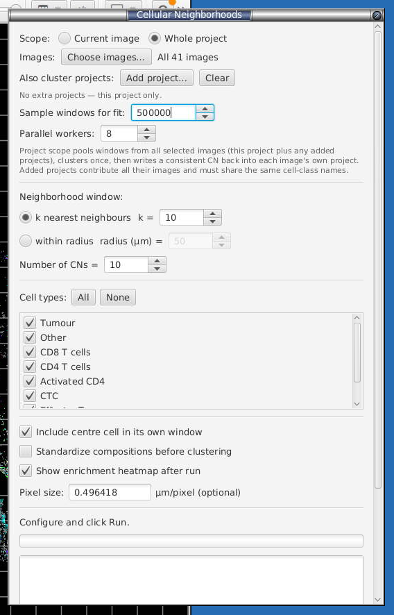
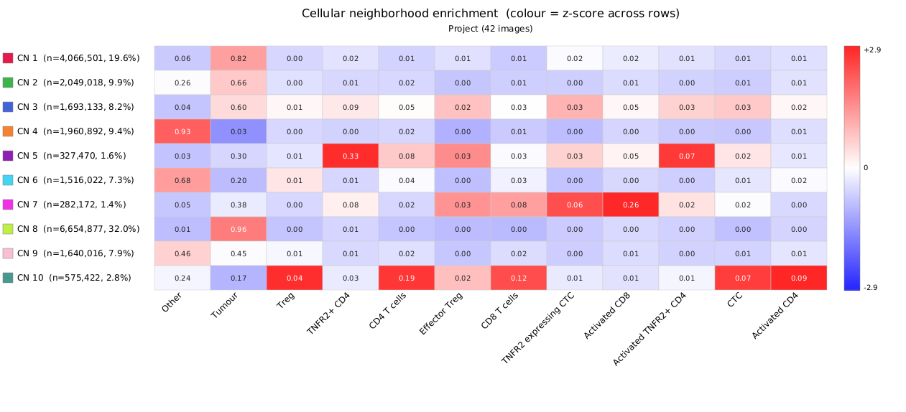
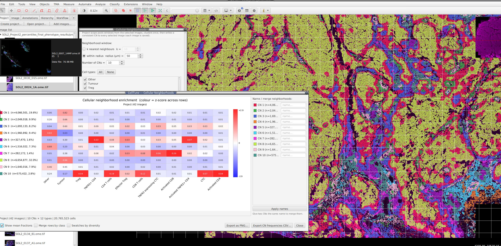

# Cellular neighborhoods (spatial micro-environments)

**Menu:** *Extensions → SP Classify → Cellular Neighborhoods...*

Cellular neighborhoods (CNs) group cells not by *what they are* but by *what surrounds them*. Instead of a cell's own phenotype, each cell is described by the **cell-type mixture of its local spatial window**, and those mixture vectors are clustered so the tissue is partitioned into recurring micro-environments — tumour core, tumour–stroma interface, immune niches, and so on. This is the Schürch/Nolan method — Schürch et al., "Coordinated Cellular Neighborhoods Orchestrate Antitumoral Immunity at the Colorectal Cancer Invasive Front," *Cell* 2020 ([full citation & acknowledgement in the README](https://github.com/mikemcka/qupath-extension-sp-classify/blob/main/README.md)). If you use this feature, please cite that paper.

**The purpose of the clustering.** A per-cell phenotype tells you *what a cell is*; it says nothing about *where it sits*. Two CD8 T cells with identical marker profiles behave very differently if one is buried in tumour and the other is in an organised immune aggregate at the invasive margin. CN clustering recovers that spatial context automatically: rather than you hand-drawing "tumour", "stroma" and "interface" regions, k-means discovers the handful of recurring tissue states directly from the local cell-type composition, then labels **every** cell with the state it lives in. The output is both a **map** (regions you can see and overlay in the viewer) and a **per-image number** (what fraction of each patient's tissue is each state) that you can carry into cohort statistics.

It is fully **non-destructive**: the CN id is written as a numeric `CN` measurement (and, once you name them, a `CN Class` text label in each cell's metadata plus a numeric `CN Class code`), never as a QuPath classification, so your trained phenotypes (`getPathClass()`) are untouched. Requires cells that already carry classifications (run the classifier first, or import them).

### 18.1 When to use it

- You want to find **tissue architecture** (tumour vs stroma vs interface) or **immune micro-environments** (an activated-CD8 niche, a Treg pocket) that a per-cell phenotype can't express.
- You want a **per-image feature** that is comparable across a cohort — e.g. "what fraction of each patient's tissue is the activated-CD8 niche" — for downstream group comparisons.

### 18.2 How the clusters are computed

The pipeline is the same four steps whether you run one image or the whole project:

1. **Neighbour window** — for every cell, find its local spatial neighbourhood, in one of three modes:
   - **k nearest neighbours** — each cell's neighbourhood is built from its closest *other* cells of *any* type (Euclidean on centroids). The **window (cells)** spinner sets the **total window size**: with **Include centre cell** on the window is the centre cell plus its nearest neighbours; with it off it is that many nearest neighbours. The **default of 10 matches the paper** — a 10-cell window (Schürch et al. use the 10 nearest neighbours *including the cell itself*). *(The spinner counts total cells; internally the centre is one of them, so a window of 10 with the centre included finds 9 neighbours.)*
   - **within radius** — every cell within a fixed radius (in µm when calibrated, else px).
   - **Delaunay triangulation** — neighbours are the cells joined to it by an edge of the Delaunay triangulation, so the window adapts to local density (denser regions → tighter windows) with no *k* or radius to pick. Long edges are pruned so sparse/border cells aren't linked across empty tissue: choose **max edge** for a fixed cutoff (default `50` µm — cell centroids are typically 10–30 µm apart, so this keeps immediate neighbours and clips cross-void links) or **auto (Q3+1.5·IQR)** to cut each image at the Tukey upper whisker of its own edge-length distribution (adapts per image across a mixed-density cohort — the convention used by Giotto's Delaunay network). A cell whose every Delaunay edge is pruned gets an empty window (`CN = -1`), just like a too-small radius.

   All three use a spatially-indexed search (JTS `STRtree` for kNN/radius, JTS `DelaunayTriangulationBuilder` for Delaunay), so it scales to hundreds of thousands of cells per image. A cell's own coordinates are excluded from its neighbour list (the centre is added back separately by the option below).

2. **Composition vector** — each window becomes a vector of **cell-type fractions** (what proportion of the window is Tumour, CD4 T, Treg, …), over the cell types you ticked. With **Include centre cell in its own window** on (paper default), the cell's own type is counted too. Cells whose class you didn't select — or that are unclassified/ignored — are excluded from the fractions. A window that ends up empty (no selected-type neighbours) is flagged `CN = -1` and left out of clustering. (The paper clusters raw type *counts*; for a fixed-size kNN window that is mathematically identical to clustering fractions, since every window is scaled by the same fixed cell count.)

3. **k-means clustering** — the composition vectors are clustered into **Number of CNs** groups with k-means. Each resulting cluster is one cellular neighborhood; every cell gets its cluster id written to the `CN` measurement (1-based; empty windows = `-1`). By default k-means is run several times from different seeds and the tightest (lowest-inertia) fit is kept — see the reproducibility note below.

4. **Interpretation** — the mean composition of each CN feeds the enrichment heatmap and the diversity overlay.

> **Raw vs standardized (the most important knob).** By default k-means clusters the **raw fractions**, matching the paper — this tends to resolve the *dominant* architecture (a tumour-purity gradient, stroma, interface). Tick **Standardize compositions before clustering** to z-score each cell-type column first, putting rare and common types on equal footing. Standardization pulls out **specific immune niches** far more sharply (each rare population tends to claim its own CN), but it **coarsens the tumour/stroma bulk** (much of the tissue collapses into one or two large CNs). Neither is "more correct" — pick by your question: architecture → leave it off; immune contexture → turn it on. If you want both, standardize at a higher **Number of CNs** (12–15) and merge the redundant tumour CNs afterward (§18.5).

> **Seed reproducibility.** k-means starts from a random guess, so a single run is a dice roll — on validation data (the Schürch/Nolan replication) agreement with the published neighborhoods swung by ~0.3 (ARI) on seed alone. Tick **Sample multiple k-means seeds** (on by default) to run the clustering 10× and keep the lowest-inertia result, so runs are **reproducible** and unlucky seeds are avoided. Untick it for a single, faster run when iterating on parameters. It does not change *what* the method finds, only which local optimum you land in.

### 18.3 Scope: current image vs whole project

At the top of the dialog, **Scope** chooses what you cluster:

- **Current image** — fits k-means directly on every non-empty window of the open image. Fast, self-contained, good for exploring parameters on one slide.
- **Whole project (cohort)** — fits **one** model across the images you choose, then writes a **consistent** CN to every image (CN 3 = the same micro-environment in every slide). This is what makes cross-patient comparison valid. It runs in two streaming passes so the whole project is never held in memory at once:
  1. **Sample (fit):** pool a bounded random sample of windows across the selected images — drawn evenly per image so no single large slide dominates — and fit k-means once on that pool. The **Sample windows for fit** spinner caps the pool (50k is plenty for stable centroids); every cell is still assigned afterward.
  2. **Assign:** stream image-by-image, recompute every cell's composition, assign it to its nearest fitted centroid, write the `CN` measurement, and **save each image**.

  Choosing project scope reveals **Choose images…**, **Add project…**, the **Sample windows for fit** spinner, and the **Parallel workers** spinner (§18.6).

#### Clustering more than one project together

To pool several QuPath projects into **one** fit — e.g. two staining batches or two cohorts — click **Add project…** and select the other project's `project.qpproj`. Each added project contributes **all** its images; the fit pools this project's selected images plus every added project's images, and the assign pass writes CN back into **each image's own project** (each is read and saved in place). Nothing is copied between projects, so there's **no data duplication and no disk-quota blow-up** from merging `.qpdata` files. **Add project…** → **Clear** removes the added projects.

> Two requirements for pooling to be valid: the projects must use the **same cell-class names** (compositions are keyed by class-name string), and be mindful of **batch effects** between separately-stained cohorts — check the CN-frequencies CSV for a per-project split, and consider **Standardize compositions** (§18.2). The cell-type checklist is read from the **open** image, so open a representative slide before running.

### 18.4 Running it — step by step

*The dialog set for a whole-project run: 41 images pooled, a 500k-window fit sample, a kNN window, 10 CNs, the cell-type checklist, and the option tick-boxes. (This screenshot pre-dates later changes; the kNN control now reads **window (cells)** and defaults to `10` — the paper's 10-cell window — and a fourth option, **Sample multiple k-means seeds**, has since been added — see §18.2.) See §18.2 for what each option does.*

1. Open **Cellular Neighborhoods…**. Pick **Scope** (and, for project scope, **Choose images…**, plus **Add project…** to pool other projects).
2. Choose the **Neighborhood window**: **k nearest neighbours** (set **window (cells)**; default `10` = a 10-cell window including the centre cell, matching the paper — see §18.2), **within radius** (set the radius), or **Delaunay triangulation** (density-adaptive; pick **max edge** with a fixed µm cutoff, default `50`, or **auto (Q3+1.5·IQR)**). Radius in tissue units is the more physically interpretable choice when calibrated; Delaunay is the choice when cell density varies a lot within or across images.
3. Set **Number of CNs** (paper default 10). Fewer = coarser regions; more = finer, but expect redundancy you can merge later.
4. Tick the **Cell types** to include (**All** / **None** shortcuts). Leave out debris/ignore classes.
5. Options: **Include centre cell** (leave on to match the paper), **Standardize compositions** (see §18.2), **Sample multiple k-means seeds** (leave on for reproducible results — see §18.2), **Show enrichment heatmap after run**.
6. **Pixel size** (µm/pixel) — optional; pre-filled from the image calibration. Set it if your images are uncalibrated and you want the radius interpreted in microns.
7. For project scope, set **Sample windows for fit** and **Parallel workers**.
8. Click **Run**. The log streams progress; in project scope you'll see per-image `sampled …` then `CN assigned …` lines, interleaved across workers.

### 18.5 The enrichment heatmap — reading, naming, merging

If **Show enrichment heatmap** is on (or click **Show heatmap** later), you get the CN-by-cell-type enrichment map:

- **Rows** = CNs (with cell counts and % of all cells); **columns** = cell types.
- **Numbers** = each CN's mean composition fraction (**Show mean fractions**).
- **Colour = z-score across each row** — it highlights the type a CN is *relatively enriched* for, so a rare population lights up bright red even at a low absolute fraction. Read the colour (what defines the CN) and the number (how much of it there is) together.

*A finished 10-CN fit across a 42-image project. This is the main **outcome** you interpret. Reading a few rows shows what you typically get: **CN 8** (32.0% of all cells, tumour fraction 0.96) and **CN 1** (19.6%, 0.82) are the tumour bulk — the large, dominant architecture. **CN 4** (0.93 "Other") is stroma/background. The small, immune-defined rows are the biology you were after: **CN 5** (1.6%) is a TNFR2⁺ CD4 niche (0.33), **CN 7** (1.4%) an activated-CD8 pocket (0.26), and **CN 10** (2.8%) a Treg / activated-CD4 mix. Notice the split of outcomes: a raw-fraction fit like this resolves the dominant tumour/stroma structure cleanly but spreads it across several near-duplicate tumour CNs (1, 2, 8, 9) — the redundancy you collapse by giving them the same name (below), or avoid by ticking **Standardize compositions** to sharpen the rare immune niches instead (§18.2).*

**Name / merge:** type a name next to each CN and click **Apply names**. This writes two things to every cell, non-destructively:

- **`CN Class`** — the **name** you typed (e.g. "tumour"), as a **text label in the cell's metadata**. QuPath measurements can only hold numbers, so the readable name lives in the metadata map, where it appears as a text column in the detection table and in cell-table exports. Empty-window cells get `Unassigned`.
- **`CN Class code`** — a numeric code (1..m) for the same grouping, which is what the **Color by: CN Class** overlay uses (a colour map needs a number).

**Giving two CNs the same name merges them** under one name and one code — the intended way to collapse the redundant CNs that a high **Number of CNs** produces (e.g. name three tumour-dominated CNs all "Tumour"). Merging only affects `CN Class` / `CN Class code`; the raw `CN` measurement keeps every original cluster id (1..k).

**Where the results are stored.** All three outputs are written per cell and are **non-destructive** — none of them touch the cell's QuPath classification (`getPathClass()`), so your trained phenotypes are untouched. They appear as columns in the detection measurement table and in cell-table exports (§[12.1](exporting.md#121-cell-table-export)):

| Result | Written when | Stored as | Key | Values |
|---|---|---|---|---|
| Raw cluster id | **Run** | numeric **measurement** | `CN` | 1..k (empty-window cells = `-1`) |
| Named class (readable) | **Apply names** | text **metadata** string | `CN Class` | the name you typed (empty-window cells = `Unassigned`) |
| Named class (numeric) | **Apply names** | numeric **measurement** | `CN Class code` | 1..m (drives the *Color by: CN Class* overlay) |

> The human-readable `CN Class` lives in the cell **metadata** map (not the measurement list) because QuPath measurements can only hold numbers. In cell-table exports it comes through as a text column — make sure to tick it in the export column chooser, as metadata columns are listed after the numeric measurements.

> **Saving & scope.** In **project scope**, Apply names is **cohort-wide**: it streams every image from the run (in parallel, reusing the **Parallel workers** count), writes `CN Class` / `CN Class code` to each cell from its saved `CN` id, and **saves every image** — so the whole cohort gets consistent, named classes in one click. The open image is updated live and saved too; the log streams per-image progress. In **current-image scope** it writes to the open image only and does **not** auto-save — press **Ctrl+S** to persist.

**Export:** **Export as PNG…** saves the heatmap; **Export CN frequencies CSV…** saves the sample-by-CN frequency table — the key output for cohort analysis and for checking whether a CN's abundance tracks your biological groups (signal) or your staining batches (a batch effect to rule out).

### 18.6 Parallel workers (project scope) — performance

Both cohort passes (sample and assign) process images **in parallel**, one worker per image, controlled by the **Parallel workers** spinner (defaults to `min(8, cores − 1)`, up to your core count). Because each image is an independent read → compute → (for the assign pass) write+save, this scales close to linearly until you hit disk or memory limits.

- **Each worker loads a full image's cell hierarchy**, so higher worker counts are faster but use more memory. Dial it back on very large slides (hundreds of thousands of cells each).
- **Many small images:** raise the worker count.
- **A few very large images:** 2–4 workers is often the sweet spot.
- Results are **deterministic regardless of worker count** — each image is sampled with its own fixed seed, so the fit is reproducible run to run (and with **Sample multiple k-means seeds** on, the k-means fit itself is stabilised too — §18.2).

### 18.7 Viewer overlays

Three one-click, non-destructive recolourings drive the viewer from the last run (they map measurements via QuPath's overlay mapper; cells with `CN = -1` keep their phenotype colour):

- **Color by: Neighborhood (CN)** — a distinct, **adjacency-aware** categorical palette (spatially-touching CNs get maximally contrasting colours so regions are easy to tell apart).
- **Color by: CN Class** — colours the merged, named classes after you **Apply names** (driven by the numeric `CN Class code`).
- **Color by: diversity** — colours each cell by its neighbourhood's cell-type **Shannon diversity** (0 = one type dominates, 1 = an even mix), useful for finding mixing zones and interfaces.

Each toggle flips back to the classification colouring on a second click, and **closing the dialog automatically reverts the viewer to phenotype classifications** (so an active CN overlay never lingers and hides your classes).

*The **Color by: Neighborhood (CN)** overlay painting the whole slide by micro-environment, next to the enrichment heatmap and the **Name / merge neighborhoods** panel. The adjacency-aware palette makes the tissue architecture legible at a glance — the yellow tumour bulk, the red/blue stromal and interface bands threading between the tumour islands, and the scattered immune pockets — turning the abstract cluster ids into a map you can read against the H&E-like structure. Type names into the panel on the right and click **Apply names** to collapse the redundant CNs and drive the **Color by: CN Class** overlay.*

### 18.8 Tips & cautions

- **CN frequency varying across samples is usually the signal**, not noise — it's the per-patient readout you're after. But first rule out that it's technical: since the CN input is your phenotype labels, any **staining/batch effect in classification propagates straight into CN frequencies**. Check the frequencies CSV against your groups vs your batches.
- **Watch for CN definitions encoding sample identity** — if a CN's cells come almost entirely from one or two images, that cluster may reflect an outlier slide rather than shared biology. Sub-2% CNs are the most fragile; confirm they replicate before interpreting.
- **Run the classifier first.** CNs are only as good as the phenotypes underneath them.
- The **radius** window makes density matter (dense regions have bigger windows); **kNN** normalises for density (every window has the same fixed number of cells). Choose deliberately.

---
