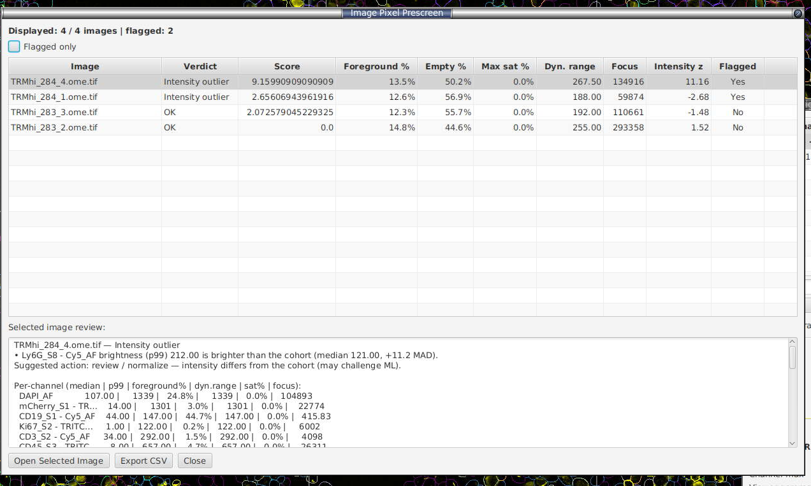

# Image pixel prescreen (whole-image QC, no cells needed) - Experimental

**Menu:** *Extensions → SP Classify → Image Pixel Prescreen...*

A **prescreen you run at the very start of a project** — before any segmentation or
classification exists. It reads a low-resolution version of every image straight
off the pyramid and summarises each one by its raw pixel intensities, then ranks
and flags images against the cohort. Use it to spot slides that are mostly
background, over-exposed, weakly stained, or otherwise unusual, so you can fix or
exclude them before investing in analysis. It is useful to identify images which will 
need additional attention and labelling during cell classification. It is the pixel-level twin of the
[Project Prediction Summary](prediction-summary.md) (which needs cells);
this one needs none.

### How it works

1. For each project image, the extension reads the **nearest pyramid level whose long
   edge is ≈ 2048 px** (requested downsample = `longEdge / 2048`). Reading every
   image to the same pixel footprint keeps the cohort statistics comparable
   like-for-like, regardless of each slide's native size or pyramid structure.
   Images are **read in parallel** (a small fixed thread pool) so large projects
   scan several-fold faster.
2. Channels are **aligned across images by name**.
3. Per-channel statistics are computed (below), including a per-channel **focus**
   (Laplacian variance) sharpness proxy.
4. The image-level summaries and each **signal-bearing** channel's brightness
   (`p99`) are converted to **robust z-scores** (`0.6745 × (value − median) / MAD`)
   **across the cohort** — the same robust machinery as §8.
5. Deterministic threshold rules assign each image a **verdict**, a set of
   **flags**, and a plain-English **review**.

### What each statistic means

Per channel, over all pixels of the low-resolution image (values sorted ascending
where percentiles are involved):

| Statistic | Definition | What it tells you |
|---|---|---|
| **median** | 50th percentile | Robust brightness; the main sort/comparison value (mean's outlier-resistant cousin). |
| **mean** | `Σx / N` | Brightness including the tails; sensitive to hot pixels by design. |
| **std** | population standard deviation | Spread of intensities. |
| **min / max** | extrema | `max` is shown but **not** used for flagging — one hot pixel moves it. |
| **p1 / p99** | 1st / 99th percentiles | `p1` = noise floor, `p99` = true signal ceiling; both ignore single extreme pixels. |
| **saturation fraction** | fraction of pixels ≥ `0.999 × dtypeMax` | Clipping / over-exposure. `n/a` for floating-point images (no fixed max). Uses the **storage bit depth** (e.g. 255 for 8-bit, 65535 for 16-bit). |
| **Otsu threshold** | foreground/background split from the channel histogram | The cutoff used for the next two rows. |
| **background fraction** | fraction below the Otsu threshold | How much of the channel is background. |
| **foreground coverage** | `1 − background fraction` | How much real signal — the direct **"lots of background"** measure. |
| **dynamic range** | `p99 − p1` | Flat / weak / empty channels score near zero. |
| **Laplacian variance (focus)** | variance of the discrete Laplacian over the image | No-reference sharpness proxy (higher = sharper). Intensity-scale dependent, so best read within a cohort. |

Image-level (derived across channels):

| Statistic | Definition | What it tells you |
|---|---|---|
| **empty fraction** | fraction of pixels below the Otsu threshold in **every** channel | The single best "this slide is mostly glass/background" indicator. |
| **focus** | **max** per-channel Laplacian variance (the sharpest channel) | Sharpness proxy. **Surfaced for inspection only — never flagged**, because it tracks overall brightness as much as true focus (a dim-but-fine slide reads as low focus). The max ignores near-dead channels, which sit near zero. |
| **intensity z** | largest **signal-bearing** channel `p99` (brightness) robust-z vs the cohort | Drives the **intensity-outlier** flag — surfaces slides whose brightness profile diverges from the cohort (a likely ML challenge). Only channels with real signal contribute, so near-empty markers can't trigger it. |

### Verdicts, flags, and the score

Each image gets one **verdict** and zero or more **flags** (default thresholds, all
z-scores robust/MAD-scaled):

| Verdict / flag | Fires when |
|---|---|
| `BACKGROUND_HEAVY` | mean foreground-coverage z ≤ −2.5, **or** empty-fraction z ≥ 2.5 |
| `SATURATED` | max saturation fraction ≥ 1% **and** its z ≥ 3.0 (cohort-relative), **or** ≥ 5% in absolute terms (clipping that severe is a defect on its own) |
| `WEAK_SIGNAL` | median dynamic-range z ≤ −2.5 |
| `INTENSITY_OUTLIER` | a **signal-bearing** channel's `p99` (brightness) z magnitude ≥ 2.5 (bright **or** dim) |
| `OK` | none of the above |

> **Why signal-gated?** Intensity-outlier detection runs only on channels whose
> cohort-median foreground coverage clears a small floor (~5%). Near-dead markers
> (whose `p99` hovers at the noise floor) are excluded, so their meaningless
> relative jitter can't manufacture false "outlier" flags. **Focus is computed and
> shown but never flags** — see the image-level table above.

The **Score** is the sum of the positive deviations that drive those flags — higher
means more unusual versus the project baseline. The table is sorted by Score by
default.

**Table columns:** Image, Verdict, Score, Foreground %, Empty %, Max sat %,
Dyn. range, Focus, Intensity z, Flagged. **Filter:** *Flagged only*.

**Review pane** (below the table) for the selected image gives the plain-English
context, e.g.:

> TRMhi_284_4 — Intensity outlier
> • Ly6G_S8 - Cy5_AF brightness (p99) 1246.00 is brighter than the cohort (median 220.00, +11.2 MAD).
> Suggested action: review / normalize — intensity differs from the cohort (may challenge ML).

…followed by a per-channel breakdown (median | p99 | foreground% | dyn.range | sat% | focus).

**Buttons:** *Open Selected Image* (jumps QuPath there without saving the current
one), *Export CSV* (wide layout — image-level columns including `MaxFocus`,
`MaxFocusZ`, `MaxIntensityZ`, `MaxIntensityChannel`, plus a block of per-channel
columns — including `LaplacianVariance` — for every channel in the cohort), *Close*.

### How to read it

- **Sort by Score** (default). Look at the top rows first.
- **Background-heavy** → mostly glass/empty. Exclude, re-acquire, or crop to the tissue.
- **Saturated** → a channel is clipped. Fix exposure or drop it from intensity-based analyses.
- **Weak signal** → flat, low-contrast image. Staining or exposure problem.
- **Intensity outlier** → a signal-bearing channel is far brighter/dimmer than its peers. The review pane names the channel. These slides diverge from the cohort and may **challenge ML** (consider per-slide normalisation, or extra review). Check the staining batch or acquisition settings.
- **Focus** (column / per-channel) → a sharpness proxy you can **sort on** to spot blur, but it is not a verdict — low focus often just means a dim slide.
- **OK** → pixel statistics are within the normal range for the project.

> **Caveats.** Robust z is noisy on tiny projects (< ~5 images) — don't
> overinterpret. Saturation uses the storage bit depth, so a 12-bit image stored
> as 16-bit reports against 65535. Floating-point images report saturation as
> `n/a`. One downsampled image (all channels) is held in memory at a time; for
> very highly multiplexed panels this can be large — the 2048 px target is the
> place to dial it down if needed.

---
