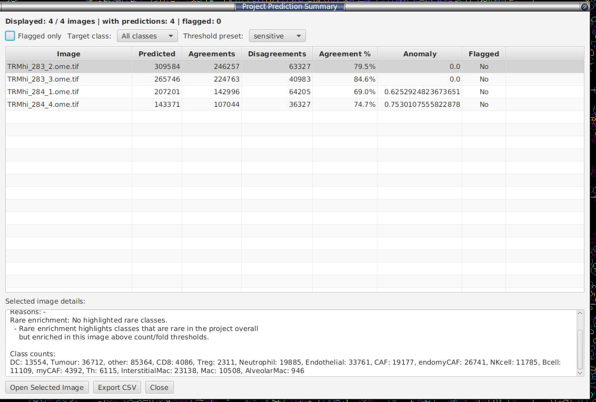

# Project Prediction Summary - Experimental

**Menu:** *Extensions → SP Classify → Project Prediction Summary...*

Cohort-level QC across every image in your project. Loads the saved `Pred_ALL` results from `<project>/celltune/image-predictions/` and runs an anomaly analysis. See [HOW_IT_WORKS_PREDICTION_SUMMARY](#anatomy-of-the-anomaly-score) below for the maths.

> For a **cells-free** prescreen that works straight off the pixels — before any segmentation exists — see §[17 Image pixel prescreen](pixel-prescreen.md).

**Table columns:** Image, Predicted, Agreements, Disagreements, Agreement %, Anomaly, Flagged.

**Filters:**
- **Flagged only** — hide rows with no flag.
- **Target class** — restrict to images where a specific rare class is enriched.
- **Threshold preset** — *strict* (anomaly ≥ 1.5), *balanced* (≥ 0.5), *sensitive* (≥ 0.0, default — shows everything). This is a **display** filter; the analysis is not re-run.

**Buttons:**
- **Open Selected Image** — jumps QuPath to that image without saving the current one (deliberately fast for navigation).
- **Export CSV** — flattened table of currently-visible rows.

**Details pane** (below the table) for the selected row: anomaly score, flag reasons, rare-enrichment summary, per-class counts.

### Anatomy of the anomaly score

For each image:

1. **Composition distance** — Jensen-Shannon distance between this image's class-fraction distribution and the project-wide baseline (with Laplace smoothing).
2. **Disagreement rate** — `disagreements / predicted`.
3. Both signals are converted to **robust z-scores** (median + MAD, so one extreme image can't suppress the scale) across the cohort.
4. `Anomaly score = 0.65 × max(0, z_composition) + 0.35 × max(0, z_disagreement)`.

**Flag reasons:**
- `RARE_ENRICHMENT` — a class that is <1% of the cohort, has ≥20 cells in this image, and is ≥3× enriched vs the baseline.
- `COMPOSITION_OUTLIER` — composition robust z ≥ 3.
- `HIGH_DISAGREEMENT` — disagreement robust z ≥ 3.

**Why these numbers?** Most are standard statistical conventions, not arbitrary:
- **Robust z ≥ 3** is the classic *3-sigma* outlier rule. The robust z uses `0.6745 × (value − median) / MAD`, where `0.6745` is the constant that makes MAD a consistent estimator of the standard deviation for normal data — so the score sits on the same scale as an ordinary z-score and "≥ 3" means the same thing it always does (~0.1% one-tailed under normality).
- **Rare enrichment (<1%, ≥20 cells, ≥3×)** is an **AND gate**: a class must be rare cohort-wide *and* have enough cells to not be noise *and* be meaningfully concentrated here. The ≥20-cell floor stops a handful of misclassifications from faking a "3× enrichment"; <1% and 3× are round "rare" / "real, not jitter" conventions.
- **Laplace smoothing** (add-one) keeps a class with zero cells in one image from blowing up the composition distance.
- **0.65 / 0.35 weighting** is the one judgement call. Composition drift (a slide whose whole class makeup differs) is a more trustworthy "this slide is different" signal than raw disagreement rate, which is noisier and partly an artefact of *which two model types* you picked — so composition gets the heavier weight. The two weights are forced to sum to 1, so the score is a convex blend, not two independent dials. Treat the score as a **ranking aid**, not a calibrated probability.

**How to use it:**
- Sort by Anomaly (default). Top rows = look at these first.
- Flagged + high disagreement → the classifier doesn't understand this slide. **Open it, label 10–20 cells, re-train.**
- Flagged + composition outlier but low disagreement → real biology that's atypical for the cohort, or staining drift / segmentation artefact. Visual check.
- Rare enrichment → check whether the rare class is real (good, you've found something) or a per-slide artefact masquerading as it.

> Robust z is noisy on tiny projects (< ~5 images). Don't overinterpret on small cohorts.

---
