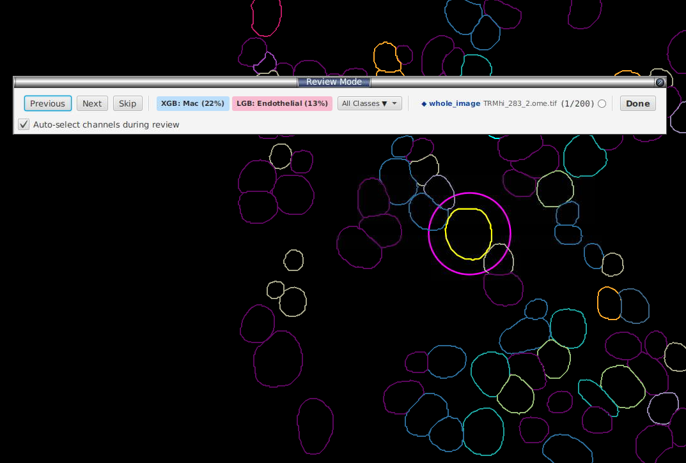
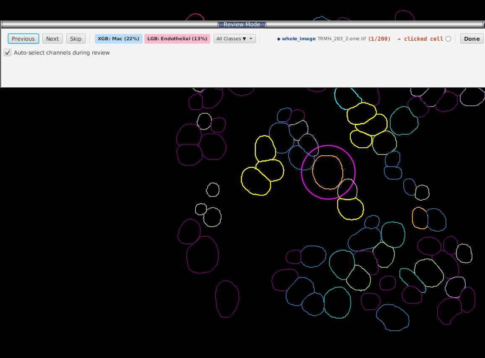

# After training — Review mode

**Button:** **Enter Review Mode** in the sidebar.

Review mode samples the **disagreement** cells (where Model 1 ≠ Model 2) using a 5-tier strategy so you don't waste labelling effort on cells that are easy or already represented. The tiers run in order and each **claims** the cells it selects, so a later tier can never re-pick a cell an earlier one already took (no double-counting):

| Tier | Goal | Default budget @ 256 cells |
|---|---|---|
| **0 — FOV balance** | Stop one slide dominating | ~84 cells, prioritising FOVs with high disagreement rate |
| **1 — Cell-type disagreement** | Cover the most confused classes | ~16 per class |
| **2 — Rare cell types** | Don't ignore small populations | ~10 per rare type |
| **3 — Preferred confusions** | User-specified pair (e.g. `CD4:CD8`) | ~8 per pair |
| **4 — Random fill** | Use any remaining budget | up to 256 |

> The budgets above are calibrated for the default 256-cell batch. If you request a different sample size, every tier budget scales linearly (`× sampleSize / 256`, floored at 1 per tier), so the tier mix stays proportional — a smaller batch isn't just the first tier truncated.

The cell currently under review is ringed in magenta in the viewer, with the toolbar showing each model's top prediction:

You can Ctrl/Cmd-click several cells at once to label a group together; the toolbar header shows `→ clicked cell` for the active selection:

**Toolbar buttons during review:**
- **Previous / Next / Skip** — navigate the queue.
- **XGB: ClassName (89%)** — accept Model 1's top prediction; blue background.
- **LGB: ClassName (76%)** — accept Model 2's top prediction; pink background.
- **Both: ClassName (XX%)** — single combined button if M1 and M2 agree.
- **Avg: ClassName (XX%)** — appears only when the two models' **averaged** probability points to a class that is neither model's own top pick; accepts that averaged prediction.
- **All Classes ▼** — pick a different class if both models are wrong.
- **Done** — exit; labels are merged back into the label store and saved per-image to `<project>/celltune/image-labels/`.

The toolbar header also shows the **name(s) of the annotation region(s)** the current cell falls inside, in bold dark blue (e.g. `◆ Tumour, Stroma`), so you keep the spatial context without leaving review.

Switching to a **different image** while a classifier is trained **auto-applies** its predictions to that image first, so you can review it immediately without a separate predict step.

If you imported a marker table (§4.4), tick **Auto-select channels during review** and the viewer will display only the markers relevant to whatever class the current cell was predicted as. The separate **Auto-adjust brightness/contrast of shown channels** box (off by default) additionally auto-sets each shown channel's display range per cell; leave it unticked to keep your own brightness/contrast.

After review, click **Train** again — the new labels feed into the next cycle.

---
