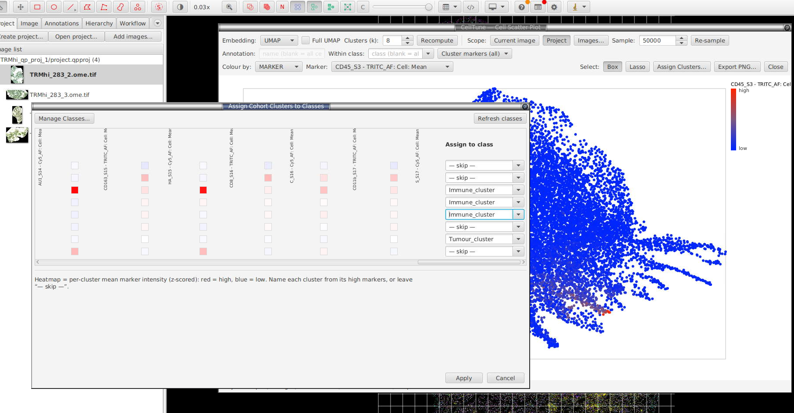
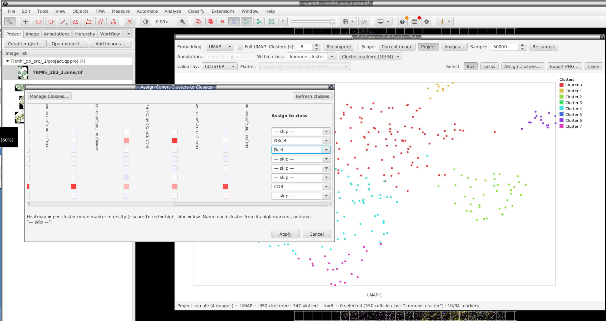
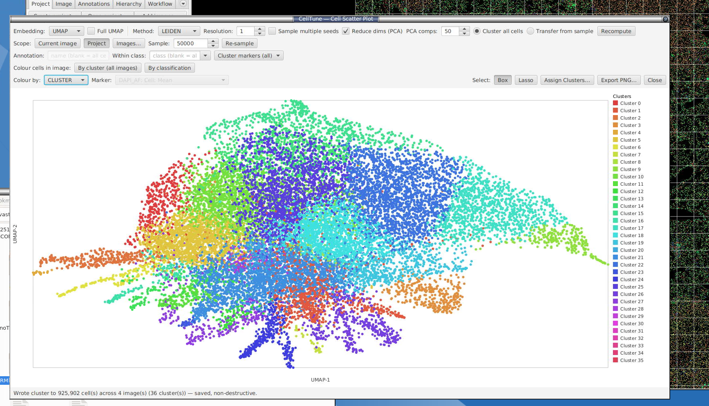

# Cell scatter plot — clustering & gating

**Extensions → SP Classify → Scatter Plots and Clustering...** opens an interactive
2D scatter plot for **unsupervised exploration**: cells are clustered — by
k-means or, optionally, graph-based Leiden clustering (§[11.6](#116-clustering-method-k-means-vs-leiden))
— on their marker measurements and projected into a 2D embedding so you can see,
label, and sub-cluster populations. This is independent of the trained
classifier — it writes to QuPath classifications, not the extension's training labels.

When you open it you first pick which measurements to embed (a *Select
Measurements for Scatter Plot* dialog). The window then computes an initial
embedding on a background thread.

> Clustering applies any **feature normalisation** you've configured
> (§[4.2](setup.md#42-clustering-normalisation)) — this is clustering-only (the classifier uses raw
> values) — then z-scores each marker over the active cells. The normalizer is captured
> when the window opens; reopen the plot after changing it.

### 11.1 Controls

**Top row**
- **Embedding** — `PCA` (fast, linear) or `UMAP` (slower, non-linear, separates
  overlapping populations better). The embedding is **for visualisation only**;
  k-means always clusters in the original marker space, not on the 2D coords.
- **Full UMAP** (checkbox, UMAP only) — by default UMAP *plots* a 20,000-cell
  sample for responsiveness (k-means still clusters **all** cells; the status bar
  shows e.g. *"309,584 clustered · 19,432 plotted"*). Tick **Full UMAP** to embed
  every cell instead — much slower and more memory-hungry on large images, but
  nothing is left out of the plot. PCA always plots all cells.
- **Method** — `k-means` (default) or `Leiden`. Choosing Leiden replaces
  **Clusters (k)** with a **Resolution** control and a reproducibility toggle —
  see §[11.6](#116-clustering-method-k-means-vs-leiden).
- **Clusters (k)** — number of k-means clusters (2–50). The legend shrinks to
  keep all clusters visible and clickable. *k-means only* — Leiden decides its
  own cluster count from the resolution instead (§11.6).
- **Recompute** — re-fit the selected clustering method + the embedding on the
  current rows (the open image, or the project sample). It does **not**
  re-sample — use **Images…** in project scope for that.
- **Scope: Current image / Project** — a toggle. *Current image* (default)
  clusters every cell of the open image with full viewer interaction. *Project*
  fits **one** k-means on a sample pooled across images you choose and drives the
  same interactive plot, so you can name and assign clusters across the whole
  cohort — see §[11.5](#115-project-wide-clustering-across-images). Switching to
  *Project* reveals an **Images…** button and a **Sample:** spinner.
- **Re-sample** — draw a fresh random sample of cells at the current **Sample:**
  cap and re-fit (project scope; in current-image scope it re-draws the plotted
  subsample). Unlike **Recompute**, which re-fits on the *existing* rows.
- **New clustering session** (next to Re-sample) — start over from scratch:
  re-opens the *Select Measurements* dialog so you can pick a different marker
  set or scope, then builds a fresh plot. You only need this to **change the
  inputs** — the plot now **remembers its clustering between closing and
  reopening** the window (reopen it from the menu and your clusters, scope and
  fit are restored as they were, with no re-clustering), so *New clustering
  session* is the deliberate way to discard that and begin again.

**Filter row (this is the gating row)**
- **Annotation** — type a keyword to cluster only cells whose centroid falls
  inside an annotation whose name (or classification) contains that text. Blank =
  all cells. Same membership test as Review mode. *Current-image scope only* — it
  is disabled in project scope, since annotations belong to one image's hierarchy.
- **Within class** — restrict clustering to cells whose current QuPath
  classification contains this text (pick from the dropdown or type). Works in
  **both** scopes: in current-image scope it combines with the annotation filter;
  in project scope it filters the pooled sample by each cell's carried class, and
  the cohort **Assign** is then restricted to that class too (so a sub-clustering
  only rewrites cells of that class).
- **Cluster markers** — a checklist of the embedded markers, all ticked by
  default. Untick markers to cluster on a focused panel (e.g. immune markers
  only). Values are **re-standardised over the active subset** each run, so
  sub-clustering scales to the subpopulation rather than the whole image. At
  least 2 markers must be ticked.

**Bottom row**
- **Colour by** — `CLUSTER` (k-means or Leiden cluster id), `CLASS`
  (current/predicted class), or `MARKER` (single-marker intensity gradient; pick
  the marker alongside).
- **Select: Box / Lasso** — drag on the plot to select those cells (in the viewer
  in current-image scope; a plot-only highlight in project scope — see §11.2).
- **Apply Clusters… / Assign Clusters…** — see §11.3. The button's label follows
  the scope.
- **Export PNG…** — save the current plot.

### 11.2 Selecting cells

- **Box / Lasso** drag selects the enclosed points.
- **Click a cluster in the legend** (CLUSTER colour mode) selects **all** that
  cluster's cells — the cursor turns to a hand over clickable legend rows.

In **current-image scope** selection is two-way: drag/click selects the cells in
the QuPath viewer, and selecting cells in the viewer outlines them on the plot.

In **project scope** the rows are pooled from images that aren't all open, so
there is no live cell to select — drag/click instead **highlights** the points on
the plot (handy to read a region's class or marker intensity). It does not change
the viewer selection.

### 11.3 Apply Clusters / Assign Clusters — assign classes to clusters

The same dialog serves both scopes. It shows one row per non-empty cluster —
colour swatch, cell count, a **per-cluster marker heatmap** (mean z-scored
intensity: **red = high, blue = low** — the cluster's phenotype fingerprint, so
you can name it from its high markers), and a dropdown to map the cluster to an
existing class, a newly typed class, or **— skip —**.

You can manage classes without leaving the dialog: **Manage Classes…** opens
[Class Control](setup.md#43-create-classes--class-control) (add / delete / merge) and **Refresh classes**
re-reads the updated class list into every dropdown. (The dropdowns are also
editable — typing a new name creates that class on assign.)

- **Current-image scope (Apply Clusters…)** — after you confirm (a second dialog
  shows the exact cell count), the chosen classes are written to those cells'
  **classification** on a background thread. Skipped/unmapped cells are untouched.
- **Project scope (Assign Clusters…)** — see §[11.5](#115-project-wide-clustering-across-images);
  the mapping is streamed and saved across every selected image.

Either way this replaces any existing class on the mapped cells; it does **not**
touch the extension's ground-truth training labels.

### 11.4 Cluster-within-clusters (hierarchical gating)

The filter row lets you gate, then re-cluster inside a gate — the standard
two-level phenotyping workflow:

1. Cluster all cells on all markers → **Apply Clusters** → assign the cardinal
   classes (e.g. **Tumour / Immune / Other**).
2. Set **Within class: Immune**, open **Cluster markers** and tick only the
   immune markers (CD45, CD3d, CD8A, CD4, CD20, PD1, FOXP3) → **Recompute**.
   Only immune cells re-cluster, on immune markers, re-standardised within the
   immune subset.
3. **Apply Clusters** again to name the sub-populations — type derived names like
   `Immune: CD8 T` (QuPath treats `Parent: Child` as a derived class).

Repeat to go deeper. The status bar reports the active scope and marker count,
e.g. *"…12,840 cells in class "Immune" · 7/24 markers"*.

> **Native libraries / `--add-opens`.** PCA and UMAP use native math libraries
> (OpenBLAS / ARPACK via JavaCPP). The extension opens the required JVM module access
> automatically at startup, so no launch flags are normally needed. If that ever
> fails on a locked-down JVM, the plot falls back to PCA and the status bar
> suggests launching QuPath with
> `--add-opens=java.base/java.lang=ALL-UNNAMED`.

### 11.5 Project-wide clustering across images

To cluster a **whole cohort consistently**, flip the **Scope** toggle to
**Project**. The extension fits **one** model on a sample pooled across the
images you choose, then (when you assign) maps *every* cell in *every* selected
image to that same cohort clustering — so cluster 3 means the same phenotype in
every image (unlike clustering each image separately, which gives non-comparable
cluster ids). It all happens in the same window, so every tool — colour-by-marker,
within-class gating, the cluster-marker subset, the centroid heatmap — is
available for naming the cohort's clusters.
**k-means** assigns by nearest cohort centroid; **Leiden** assigns by kNN label
transfer against the labelled fitted sample — see §[11.6](#116-clustering-method-k-means-vs-leiden).

**Entering project scope**

1. Click **Project**. An image picker opens — choose which project images to
   sample (defaults to all). Cancel to stay on the current image.
2. The extension streams each image and pools a bounded random sample (the **Sample:**
   spinner, default 50,000, drawn evenly per image), then fits k-means and draws
   the plot. The status bar reads e.g. *"Project sample (8 images)"*.

The sample only bounds the **fit** — 50,000 cells is statistically ample to place
stable centroids (more barely move them but cost time). **Every** cell is still
classified later in the assignment pass, so memory stays flat regardless of
project size.

**Working with the cohort sample**

The plot behaves like the single-image one, with the project caveats already
noted: the Annotation filter is disabled (§11.1), and box/lasso/legend selection
highlights on the plot only (§11.2). Everything else applies:

- **Colour by → MARKER** to read which clusters are high in which marker.
- **Within class** to sub-cluster one population across the cohort (the assign is
  then restricted to that class — §11.1).
- **Cluster markers** to fit on a focused panel.
- **Recompute** re-fits on the existing sample (fast). To draw a fresh sample —
  different images, or a new **Sample:** size — click **Images…**.

**Assigning across the cohort**

Click **Assign Clusters…**. The shared assignment dialog (§11.3) shows the
per-cluster mean marker heatmap and a class dropdown per cluster. On confirm,
The extension streams each selected image, assigns all matching cells to their cluster
(nearest centroid for k-means; kNN label transfer against the fitted sample for
Leiden — §[11.6](#116-clustering-method-k-means-vs-leiden)), writes the mapped
classes, and **saves each image**, with progress in the status bar.

> **Measurement scaling & batch effects.** Clustering applies the extension's feature
> normalisation (§[4.2](setup.md#42-clustering-normalisation)) — arcsinh / sqrt, a **clustering-only**
> step (the classifier uses raw values) — then z-scores each marker over the active cells
> at fit time. So if you've configured normalisation, it shapes the clusters and
> the colour-by-marker view too. (The normalizer is captured when the window
> opens; change it via *Clustering Normalisation* and reopen the plot to pick it up.)

**Leiden cohort modes: "Cluster all cells" vs "Transfer from sample"**

When **Method = Leiden** and **Scope = Project**, a radio pair appears next to the
Method selector (hidden for k-means, and hidden in current-image scope):

- **Cluster all cells** (default) — the exact, true-scanpy `sc.tl.leiden`-style
  mode: **every** cell across every selected image is pooled into one feature
  matrix, one approximate-NN (HNSW) kNN graph is built over the whole cohort, a
  **single** CWTS Leiden partition runs over that entire graph, and each cell's
  community label is written back to its source image by its stable cell UUID
  (not by iteration order — safe even if a second read of an image returns cells
  in a different order). This genuinely clusters every cell, rather than
  approximating the rest of the cohort from a sample.
- **Transfer from sample** — the fast/approximate mode retained from the previous
  release: Leiden fits once on the pooled sample, then every other cell is
  assigned by kNN label transfer against that labelled sample (`sc.tl.ingest`-style
  — see §[11.6](#116-clustering-method-k-means-vs-leiden)).

Clicking **Assign Clusters…** / **By cluster (all images)** with **Cluster all
cells** selected runs the two-pass all-cells driver instead of the transfer path:

- **Soft cell-count ceiling.** Before pooling starts, the extension does a quick
  count-only pass over the selected images to estimate the total pooled cell
  count. If that estimate is above a configurable ceiling (50,000,000 cells by
  default), an extra confirm dialog warns you before the run begins — it warns,
  it does not hard-block.
- **Per-phase progress.** The status bar reports each phase as it happens —
  *"Pooling 12/40 images"* → *"Building kNN graph…"* → *"Running Leiden…"* →
  *"Writing 12/40 images"* — followed by the run's outcome.
- **ANN recall gate.** The HNSW graph build is checked at runtime against an
  exact nearest-neighbour reference on a small sample; the status line reports
  the measured recall (e.g. *"ANN recall 0.982 — passed"*) when the driver
  exposes it. If recall cannot reach the required 95% after auto-tuning, the run
  **aborts with no `Cluster` labels written at all** — an actionable error
  explains why; existing `Cluster` measurements from a previous successful run
  are left untouched.
- **Cancel.** A **Cancel** button appears only during an all-cells run. Cancelling
  stops the write pass before its next image — images already written keep their
  `Cluster` measurement (no rollback); the final status line reports how many
  images were, and were not, written.
- **Legend re-sync.** After a successful (non-cancelled, non-aborted) all-cells
  write, the scatter legend and the open image's overlay re-sync to the **final
  all-cells cluster count** — the number Leiden actually found across the whole
  cohort — not the interactive preview's (subsample-based) cluster count. The
  interactive plot itself always stays subsample-based for responsiveness; only
  the persisted `Cluster` measurement (and, after the write, the legend/overlay)
  reflects the full all-cells run.

Single-image Leiden (current-image scope, and the interactive project-scope
preview fit) also builds its kNN graph through the same HNSW approximate-NN index
now, rather than a brute-force scan — this is transparent (no extra control) and
only matters if you happen to hit the same recall gate on a single image, in
which case the status bar reports it and asks you to try more cells or different
markers.

> **Fidelity vs stock scanpy.** The extension's Leiden clustering (both cohort modes
> and the single-image path) is a close, but not bit-identical, match to running
> `sc.tl.leiden` in Python. Two remaining documented gaps (a third — PCA — is now
> implemented, see below):
>
> 1. **Quality function** — the bundled CWTS Leiden library optimises the
>    **Constant Potts Model (CPM)**, not scanpy's default **modularity**
>    (RBConfiguration). The `Resolution` control behaves like the familiar
>    scanpy/leidenalg knob (association-strength normalisation keeps it on the
>    same rough scale), but is not numerically identical to a modularity run.
> 2. **Edge weighting** — the extension weights the kNN graph by **Jaccard
>    similarity of shared nearest neighbours (SNN)**, not scanpy's **UMAP
>    fuzzy-simplicial-set connectivities**.
>
> Neither is expected to change population-level conclusions for multiplex-
> imaging marker panels, but an external `sc.tl.leiden` run on the same data is
> not guaranteed to reproduce identical cluster boundaries.

> **PCA dimensionality reduction (scanpy `scale → PCA → neighbors` recipe).**
> Both cohort modes and the single-image path apply a conditional PCA reduction
> to the z-scored marker matrix *before* building the clustering kNN graph (both
> k-means and Leiden) — a **"Reduce dims (PCA)"** checkbox (on by default) and a
> components spinner (default 50) sit next to the Resolution/k controls. Below
> ~50 active marker columns this is a no-op (a small, curated panel is already
> low-dimensional — projecting onto ≥ p components is just a lossless rotation),
> preserving the exact prior small-panel behaviour. Above that threshold — real
> projects can carry hundreds to 1000+ per-cell measurements (each marker × mean/
> median/percentile × nucleus/cytoplasm/membrane) — unreduced Euclidean kNN both
> lets whichever marker happens to have the most measurement columns dominate
> the distance, and suffers high-dimensional distance concentration; PCA fixes
> both. The reduction uses the same exact (deterministic, non-randomized) Smile
> `PCA` eigendecomposition already used for the 2D display embedding, so the
> reproducible-seed clustering path stays bit-stable. Per-cluster centroids (the
> Assign-dialog heatmap) and the interpretive marker view are always computed in
> the **original marker space**, never the PCA space — only the neighbour graph
> itself is built on the reduced matrix. On the all-cells cohort path, the PCA
> projection is **fit on a bounded seeded subsample** (like the ANN recall gate's
> sampling) when the pooled cohort is very large, then applied to every pooled
> cell — bounding fit cost/memory independent of total cell count. When applied,
> the status bar/log reports `PCA: {p} → {nComp} comps, {variance}% variance`.

> **Citing.** Graph-based clustering here uses the **Leiden algorithm** (Traag,
> Waltman & van Eck, *Sci. Rep.* 2019) and mirrors the **scanpy** scale → PCA →
> neighbours → Leiden recipe (Wolf, Angerer & Theis, *Genome Biol.* 2018); the
> scalable kNN graph uses **HNSW** (Malkov & Yashunin, *IEEE TPAMI* 2020). If
> graph-based clustering is central to your analysis, please cite these — full
> citations and the bundled-library licenses (CWTS `networkanalysis`, jelmerk
> `hnswlib-core`) are in the [README acknowledgements](https://github.com/mikemcka/qupath-extension-sp-classify/blob/main/README.md).

### 11.6 Clustering method: k-means vs Leiden

The **Method** selector (§11.1) switches the clustering algorithm; everything
else in this section — the embedding, colouring, selection, within-class gating,
cluster-marker subsetting, and cluster→class assignment — works identically for
both, because both ultimately produce the same per-cell cluster label array.

- **k-means** (default) partitions cells into a **fixed** number of clusters (the
  **Clusters (k)** spinner, 2–50). It assumes clusters are roughly spherical and
  similarly sized, and you must pick `k` up front.
- **Leiden** is graph-based community detection — the same family of algorithm
  used by scanpy, scimap, and SPACEc for single-cell / multiplex-imaging
  phenotyping (it traces back to PhenoGraph). Instead of a fixed `k`, the extension
  builds a nearest-neighbour graph over the z-scored marker matrix, weights edges
  by neighbourhood similarity (Jaccard), and runs the Leiden algorithm — the
  **number of clusters is decided by the data**, not chosen in advance. This finds
  non-spherical and unequal-size populations — including rare cell types — that
  k-means tends to under-resolve or merge into a larger neighbour.

**Controls when Method = Leiden**

- **Resolution** (0.1–3.0, default 1.0) — replaces **Clusters (k)**. Higher
  resolution finds **more, smaller** communities; lower resolution finds **fewer,
  larger** ones. There is no fixed cluster count to set — after **Recompute** the
  status bar reports how many clusters Leiden found, e.g.
  *"…· Leiden found 7 cluster(s)"*. If you want more (or fewer) populations,
  raise (or lower) the resolution and **Recompute** again.
- **Sample multiple seeds** (checkbox) — mirrors k-means' multi-restart
  reproducibility: when ticked, Leiden runs several random-seeded passes and keeps
  the best-quality partition, so repeated runs with the same settings return
  identical clusters. Left unticked, Leiden runs a single faster pass whose exact
  result may vary run to run (the same *populations* are still found — only which
  integer id each gets can shift).

The kNN graph-neighbour count and edge-weighting scheme are fixed, sensible
defaults (not exposed as controls in this release) — see the design note in the
repository for the full recipe and rationale.

**Cohort (project scope) assignment differs by method**

Leiden has no centroids to assign new cells to — averaging a non-spherical
community into one point would defeat the method. So in **Project** scope
(§11.5), Leiden fits once on the pooled sample exactly like k-means does, but the
**assignment** pass differs:

- **k-means** assigns each cell to its **nearest cohort centroid** (Euclidean, in
  z-scored marker space).
- **Leiden**, with **Transfer from sample** selected (§11.5), assigns each cell by
  **kNN label transfer**: it finds that cell's nearest neighbours *within the
  labelled fitted sample* and takes a majority vote of their Leiden labels — the
  same approach scanpy uses (`sc.tl.ingest`) to map new cells onto an existing
  clustering. Per-cluster mean marker profiles are still computed for the
  assignment-pane heatmap either way — only the per-cell assignment mechanism
  differs. With **Cluster all cells** selected instead, there is no separate
  "assign" step at all — every cell is a first-class member of the single
  cohort-wide Leiden partition (§11.5).

Both methods otherwise share the exact same pipeline: the same z-scored active
marker matrix, the same `cluster[]` label array driving plot colour/legend/box
selection, and the same **Apply Clusters… / Assign Clusters…** dialog for naming
populations.
> Even so, per-marker normalisation does not fully correct **per-image** staining
> differences, so when cells are pooled across a cohort, comparable staining still
> matters: globally brighter slides can shift the pooled clusters. Normalise
> upstream if intensity scales differ a lot, or interpret with that in mind.

> **This writes classifications and saves every selected image.** It replaces the
> existing class on assigned cells (the extension's training labels are untouched). The
> currently-open image updates live; others are saved to disk.

---
