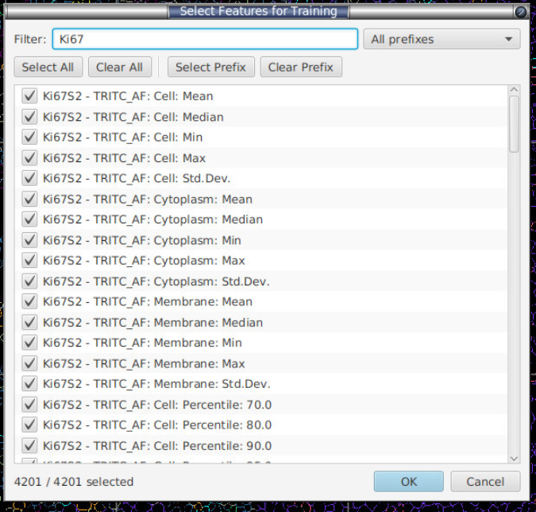
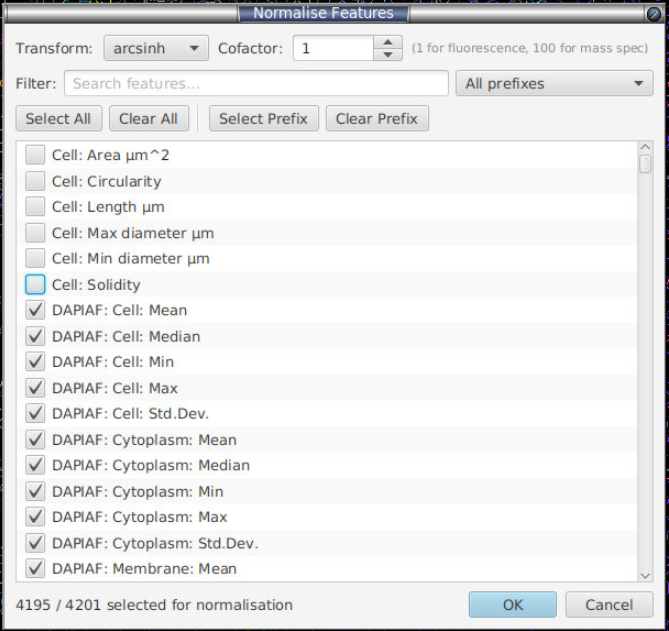

# Setup steps (shared by both workflows)

### 4.1 Select features

**Menu:** *Extensions → SP Classify → Select Features...*

QuPath cell-detection panels (COMET, MIBI, IMC, CODEX) often produce 1000–2000 measurement columns per cell. The extension lets you pick a subset for training; the rest are ignored.

- **Search** box — case-insensitive substring filter (matching groups auto-expand).
- **Grouped checkbox tree** — features are bucketed into collapsible groups (below); tick a group's parent box to select/clear every feature in it at once.
- **Select All** / **Clear All** — operate on whatever's currently visible after filtering. Great for removing large groups of features.
- **Expand All** / **Collapse All** — open or close every group.
- Checkbox per row to toggle individual features.
- Counter at the bottom: `X / Y selected`.

Features are grouped so large panels stay navigable — one group per **marker** (the text before the first `: `, e.g. `DAPI_AF`), then catch-all groups in this order:

- **Morphology / Shape** — compartment-only measurements (`Cell: Area µm^2`, `Nucleus: Circularity`, …).
- **Neighbors** — neighbour-aggregate features (`Neighbors: Mean: …`); labels keep the `Neighbors:` prefix so the context isn't lost.
- **Embeddings** — dimensionality-reduction / embedding columns: UMAP, PCA, t-SNE, and `*_emb_*`-style names (e.g. `kronos_emb_0`).
- **Other / Uncategorized** — anything matching none of the above, so nothing is silently misfiled into Morphology.



**Do you need to hand-prune for big panels?** Usually not. Both default models are gradient-boosted trees, which are robust to correlated and redundant features: at each split a tree picks the single most informative feature, so two near-duplicate columns don't distort the model the way they would in a linear/regression model — the worst case is wasted training time and *diluted* importance (a marker's signal gets split across its correlated columns, muddying SHAP plots). So extra features rarely hurt accuracy, but they do cost speed and interpretability.

Rather than manually paring the list down, leave **Auto-prune features** (§[14](sidebar-reference.md)) ticked — it removes the redundancy for you, non-destructively, at the start of every training round. Pruning runs on the **pooled, normalised training matrix**: your labelled cells *plus* the cells pooled from every other project image, after normalisation — so a feature is judged on the whole training cohort, not the open image alone. (Imported CSV rows are normalised and trained on, but are **excluded** from the prune decision, since their panel may be partial.) The stages are:

1. **Sparsity / variance filter** — drops features that are effectively constant across the pooled set (non-zero in fewer than ~5 cells, or zero variance). A feature that never varies can't help a tree split.
2. **Within-marker correlation removal** — features are grouped (see *What defines a group* below); within each group it keeps the **highest-variance** feature and drops any peer whose absolute Pearson correlation with a kept feature exceeds ~0.95. This is what collapses `CD3: Cell: Mean` / `CD3: Cell: Median` / `CD3: Cell: Max` down to one representative column.
3. **Cross-marker correlation removal** — available but **off by default**, so distinct markers are never merged just because they happen to co-vary.
4. **Per-group whitelist (top 5)** — the **5 highest-variance features in every group are always kept**, immune to the stages above. A group with 5 or fewer features keeps *all* of them. So the classifier never goes blind to a marker, and each marker retains its strongest few features even when they correlate.

> **What defines a "group" for pruning?** The group key is the text before the first `: ` (so `CD3: Cell: Mean` → `cd3`); if the name has no `: `, it's the token before the first underscore or space (so `kronos_emb_0` → `kronos`, `Distance to tumor` → `distance`). Matching is **case-insensitive** (`CD3` and `cd3` are one group). This pruning grouping is deliberately *separate* from the feature-picker categories above (Morphology / Neighbors / Embeddings) — those exist to navigate the UI; this one defines redundancy families for pruning.

Pruning takes milliseconds and **never touches the measurements on disk** — it only trims the training column list for that run. The net effect is the same "near-identical accuracy, much faster training, cleaner SHAP plots" you'd get from hand-restricting to `Cell: Mean` only, without you having to guess which columns to keep.

Your selection is saved in `<project>/celltune/classifier-state.json` and persists across QuPath sessions.

### 4.2 Clustering normalisation

**Menu:** *Extensions → SP Classify → Clustering Normalisation*

Per-feature transforms for the **clustering / scatter-plot / gating** workflows. **The classifier always trains and predicts on raw values** — normalisation configured here does not touch the phenotyping model (tree models are invariant to it anyway). Same prefix/search/select-all UI as Select Features, plus:

- **Transform** dropdown:
  - **arcsinh** — `arcsinh(x / cofactor)`. Recommended default.
    - **Fluorescence (COMET, CODEX, IF)** — scale-dependent, so there is no single right number. For **raw 16-bit-style panels** (values in the hundreds–thousands, e.g. a raw COMET panel) a cofactor in the **tens (~25–50)** fits well; ~1 suits only already-normalised / low-range intensities, and a large value (e.g. 150) leaves the dim markers essentially untransformed.
    - **MIBI mass spectrometry** — **cofactor = 0.05**, the community-standard value from Hartmann et al. (2021) / the squidpy MIBI-TOF tutorial, applied to per-cell mean intensities (see [References](how-to-cite.md)).
    - **The ideal cofactor tracks your data's intensity scale** — pick it near the background/signal boundary. Quick check: if almost every cell's raw value is *below* the cofactor, nearly all cells sit in the near-linear part of arcsinh and the transform is ≈ a no-op (e.g. cofactor 1 on MIBI means that mostly fall below 1, or 150 on dim fluorescence markers). If almost every value is *far above* it, everything is log-compressed and the low-end detail is lost. Aim for the value where the background collapses but the positive population stays resolved, and eyeball the transformed histogram to confirm.
  - **sqrt** — `sqrt(max(0, x))`. Simple variance stabilisation, no cofactor.



You pick **which** features to transform and **one** transform/cofactor applied to all of them. Untouched features stay raw.

**Do not** normalise morphological features like Cell Area or any pre-normalised features like foundation model embeddings.

**What it's for — scale-dependent methods (clustering), not the classifier.** `arcsinh(x / cofactor)` is a monotone, per-feature squash: near-linear below the cofactor, log-compressed above it, so it flattens bright outliers while preserving the dim/low-intensity detail. Its job is to stop a few high-dynamic-range markers from dominating **Euclidean distance / kNN** in the workflows that measure distances between cells — the **scatter-plot clustering** (k-means and Leiden, §[11](scatter-clustering.md)), the PCA embedding, gating thresholds, and the colour-by-marker views. There it is essential: raw 16-bit intensities left untransformed make clustering track whichever markers happen to be brightest instead of the whole phenotype.

Two things it does **not** do:

- **It never touches the classifier.** The phenotyping model always trains and predicts on **raw** values — normalisation is applied only in the clustering path. (Even if it were applied, XGBoost / LightGBM / Random Forest split on rank order and arcsinh is a strictly increasing rescale, so predictions would be unchanged at any cofactor.) Auto-prune, feature-importance/SHAP, and ground-truth export all operate on the same raw values the model sees; export no longer writes `__norm` columns.
- **It does not correct slide-to-slide (batch) differences, so it does not improve generalisation to unseen slides.** The same global transform is applied identically to every image, so it uses no per-image information and cannot remove per-slide staining/exposure offsets. Generalising across variable samples is a **batch-correction** problem (per-image or reference-based alignment) plus annotating a **diversity** of slides — not something arcsinh addresses. SP Classify provides per-image batch correction via UniFORM: see §[19](batch-normalisation.md).

**What this pane configures vs. what clustering always does.** The arcsinh/sqrt transform here is only **stage 1** of the clustering normalisation, and it is **optional** — leave it off and clustering still runs. The full pipeline every clustering fit applies is:

```
(optional arcsinh / sqrt)  →  z-score per marker  [always]  →  (PCA if >50 markers)  →  k-means / Leiden
     stage 1 — this pane            stage 2 — automatic            dim-reduction — automatic
```

- **Stage 2 — z-score is mandatory and automatic.** Every clustering fit standardises each marker (subtract mean, divide by SD) over the active/pooled cells at fit time. This is what actually puts markers on a comparable scale so no single one dominates Euclidean distance — it happens **whether or not** you configure a transform here.
- **Dimensionality reduction is automatic and conditional.** When more than ~50 marker columns are active (and the *Reduce dims (PCA)* option is on, the default), an exact PCA is applied after z-scoring, mirroring the scanpy `scale → PCA → neighbours → Leiden` recipe. Below that threshold, or with PCA off, it's skipped.

So configuring arcsinh here is the optional stage-1 *dynamic-range compressor* that runs **before** the always-on z-score — it additionally tames within-marker skew and bright-pixel outliers that z-scoring alone can't (z-score is a linear rescale and leaves a skewed marker's outliers as extreme values). If you configure nothing, clustering uses z-score (+ conditional PCA) on the raw values.

### 4.3 Create classes & Class Control

**Menu:** *Extensions → SP Classify → Class Control...*

A 4-tab dialog for managing the QuPath class panel **and** the labels saved on disk under `<project>/celltune/image-labels/`.

#### Add tab
Type a class name, click **Add Class**. Just adds it to QuPath's class panel — no label files touched.

#### Delete tab
- Pick a class from the list.
- Tick **Also remove labels with this class from all image-label files** to scrub it from every saved per-image label JSON. Leave unticked to only remove it from the class panel (labels stay on disk, invisible).
- **Delete Selected Class** (red) — asks for confirmation.

#### Merge tab
- Multi-select source classes (Ctrl/Cmd+click), then either type a target name or pick one from **Existing**.
- **Merge Selected → Target** rewrites every matching label across all images. The original name is preserved inside the label string: `test1` merged into `myType` is stored on disk as `test1-mergedInto(myType)`. Training sees only the effective class (`myType`); the audit trail makes the merge fully reversible.

#### Undo Merge tab
- Pick a class that was previously the merge target (the combo scans label files for `-mergedInto(...)` patterns).
- **Undo Merge for Selected Class** — restores every label to its original name and re-adds the source `PathClass` to QuPath's class panel. The target class is **not** deleted; you can drop it from the Delete tab if you no longer want it.

### 4.4 Import a marker table (auto channel switching)

**Menu:** *Extensions → SP Classify → Import ▸ Marker Table...*

Optional. Maps cell types to marker channels so review mode can auto-switch channel visibility to the markers relevant to each predicted cell.

**Simple format:**

```csv
CellType,Marker1,Marker2,Marker3
T-Cell,CD3,,
B-Cell,CD20,,
Macrophage,CD68,CD163,
Dendritic,CD11c,,
NK-Cell,CD56,,
```

Channel-name matching is robust (alphanumeric-normalised), so `CD3_S2 - Cy5_AF` matches the channel `CD3_S2-Cy5_AF` automatically.

In review mode, ticking the **Auto-select channels during review** checkbox makes QuPath show only the relevant markers for the cell currently under review. Untick it to navigate channels manually. A second, smaller tick-box — **Auto-adjust brightness/contrast of shown channels** — is **off by default**: tick it if you also want each shown channel's display range (brightness/contrast) re-adjusted automatically each time you move to a new cell. Left unticked, only channel *visibility* switches and your own brightness/contrast settings are preserved. (It only takes effect while auto-select is on, so it is greyed out otherwise.)

> The marker table is saved to `<project>/celltune/marker-table.json` when you import it, so it persists across QuPath restarts — no need to re-import. Importing a new CSV overwrites it.

---
